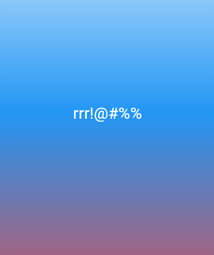

# Flutter Lab 3 — First Flutter App

Учебный проект по лабораторной работе №3: знакомство с Flutter, создание
первого приложения, изучение виджетов и дерева виджетов. Приложение
запускается в браузере Chrome и отображает стилизованный текст
«Hello world!» на градиентном фоне.

## Автор

- Имя: [Ваше Имя и Фамилия]
- Группа: [Номер группы]

## Стек и версии

- Flutter 3.41.2 (stable)
- Dart 3.11.0
- Платформа: Web (Chrome)
- IDE: VS Code

## Скриншот приложения

## Запуск

1. Клонировать репозиторий:
   git clone <URL вашего репозитория>
2. Перейти в папку проекта:
   cd Flutter_Lab3
3. Установить зависимости:
   flutter pub get
4. Запустить в Chrome:
   flutter run -d chrome

## Что изучили

- Что такое Flutter и как он рисует UI через собственный движок (Skia / Impeller).
- Понятие виджета: StatelessWidget и StatefulWidget, дерево виджетов.
- Базовые виджеты: MaterialApp, Scaffold, Container, Center, Text, Image.
- Управление состоянием через setState() на примере счётчика.
- Инструменты разработчика: Hot Reload / Hot Restart, Flutter DevTools, Flutter Inspector.
- Оформление UI: BoxDecoration, LinearGradient, TextStyle.